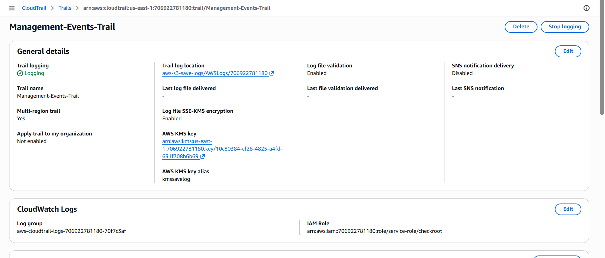

## Đề tài: Hands-On: Alert on AWS Root Account Login

## 🚀 MỤC TIÊU BÀI LAB
Thiết lập hệ thống giám sát thời gian thực (Real-time monitoring) và cảnh báo tự động qua Email bất cứ khi nào tài khoản tối cao (**AWS Root Account**) thực hiện đăng nhập vào hệ thống nhằm đảm bảo an toàn bảo mật tuyệt đối theo chuẩn AWS Best Practices.

---

## BƯỚC 1: ENABLE CLOUDTRAIL & SEND LOGS TO CLOUDWATCH

 **CloudWatch Logs** đang ở trạng thái **Enabled** và có tên **Log group**.

  
  
 
> **Kết quả đạt được:** Hệ thống đã khởi tạo thành công Trail giám sát. Trạng thái CloudWatch Logs hiển thị "Enabled", đồng thời log group đã được liên kết chính xác, sẵn sàng tiếp nhận luồng dữ liệu cấu hình luân chuyển từ CloudTrail sang CloudWatch.
---

## BƯỚC 2: CREATE CLOUDWATCH METRIC FILTER

  
  
  
> **Kết quả đạt được:** Bộ lọc Metric Filter `RootAccountLoginFilter` đã được thiết lập thành công trên Log Group. Hệ thống đã nhận diện chính xác cấu trúc Pattern để bóc tách thuộc tính `userIdentity.type = "Root"` từ dữ liệu JSON log, đồng thời gán dữ liệu đếm về Namespace `Security`.
---

## BƯỚC 3: CREATE CLOUDWATCH ALARM

  
  
  
> **Kết quả đạt được:** CloudWatch Alarm `Root-Account-Login-Alarm` đã cấu hình xong điều kiện kích hoạt. Hệ thống giám sát đặt ngưỡng (Threshold) lớn hơn hoặc bằng 1 với chu kỳ quét  5 phút, đảm bảo không bỏ sót bất kỳ một hành vi đăng nhập Root nào.
---

## BƯỚC 4: NOTIFY VIA AWS SNS

  
  
  
> **Kết quả đạt được:** Email quản trị viên đã thực hiện quy trình xác thực (Confirm Subscription) thông qua AWS SNS thành công. Trạng thái kết nối hiển thị "Confirmed", đảm bảo kênh thông báo SMS/Email luôn thông suốt để tiếp nhận cảnh báo thời gian thực từ CloudWatch Alarm khi có sự cố.
---

## 🏁 KẾT LUẬN TRẠNG THÁI HỆ THỐNG
Sau khi hoàn thành đầy đủ 4 bước trên, hệ thống giám sát an toàn tài khoản đã hoạt động đồng bộ:
* Log hoạt động đăng nhập được **CloudTrail** ghi lại và chuyển tiếp tức thì sang **CloudWatch Logs**.
* **Metric Filter** liên tục quét luồng log để tìm định danh `"Root"`.
* **CloudWatch Alarm** sẽ chuyển sang trạng thái nguy hiểm (`ALARM`) ngay khi phát hiện đăng nhập.
* **AWS SNS** chịu trách nhiệm bắn Email cảnh báo trực tiếp đến quản trị viên ngay trong vòng một phút.